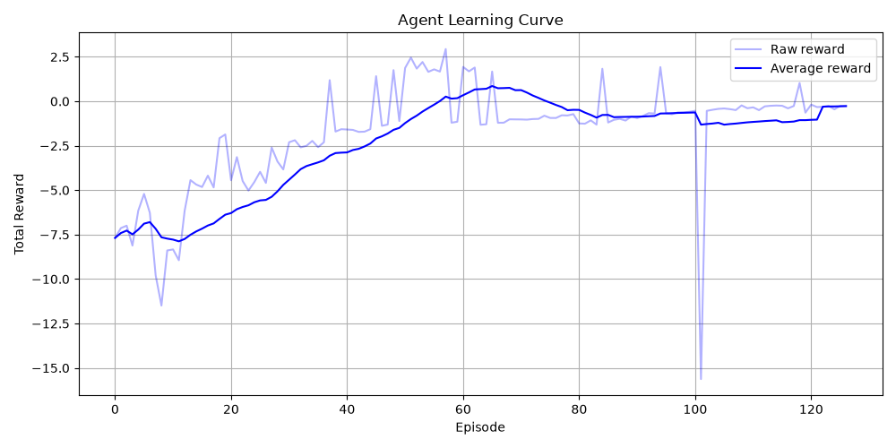
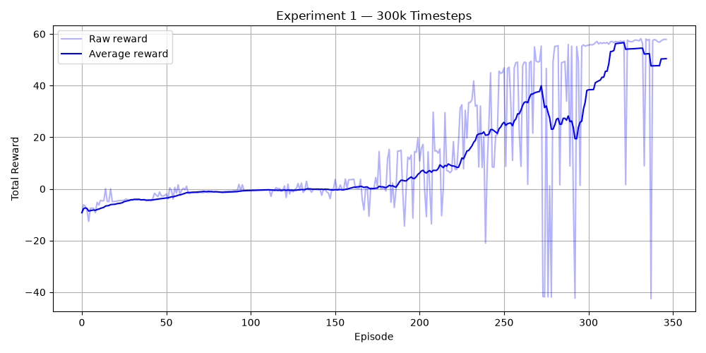
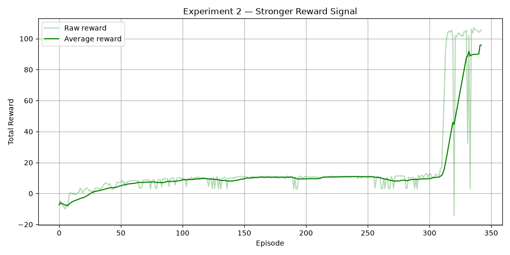
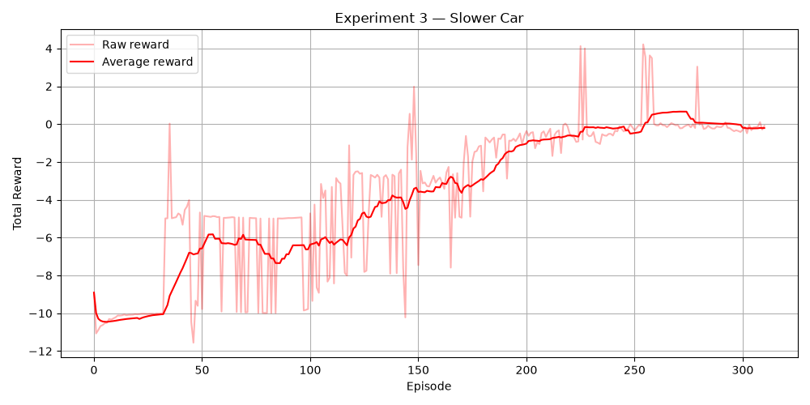
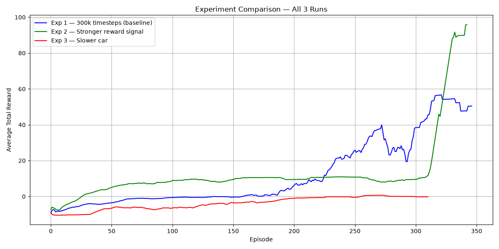

# Week 4 — RL Racing Agent

A 2D autonomous racing agent built using Reinforcement Learning.
The agent learns to drive around an oval track through trial and error
with no prior knowledge of the track.

---

## Track Design

The track is defined mathematically using ellipse equations.
A point is on track if it is inside the outer ellipse and outside the inner ellipse.

Ellipse equation used:
(dx/a)² + (dy/b)² = 1

- Result less than 1 = inside ellipse
- Result greater than 1 = outside ellipse

---

## Observation Space

The agent receives 8 values at every step:

| Input | Description |
|---|---|
| speed | Current speed normalised to 0-1 |
| sin(heading) | Vertical component of car direction |
| cos(heading) | Horizontal component of car direction |
| ray 1 to 5 | Distance to wall in 5 directions |

Why sin and cos instead of raw angle?
Raw angles jump from 360 to 0 suddenly which confuses the neural network.
Sin and cos are smooth and continuous so the agent learns better.

Why 5 rays?
5 rays cover front, front-left, front-right, left and right.
Enough awareness without making the input too large.

---

## Action Space

5 discrete actions:

| Action | What it does |
|---|---|
| 0 | Do nothing |
| 1 | Accelerate |
| 2 | Brake |
| 3 | Steer left |
| 4 | Steer right |

Why discrete actions?
Simpler for the agent to explore and PPO handles them cleanly.

---

## Reward Function

| Event | Reward |
|---|---|
| Moving forward | progress x 10 |
| Every step | -0.01 time penalty |
| Completing a lap | +5.0 |
| Crashing | -3.0 |

Why this design?
- Progress reward encourages the agent to keep moving forward
- Time penalty encourages speed
- Lap bonus reinforces the goal of completing the track
- Crash penalty teaches the agent to stay on track

---

## Algorithm

I used PPO (Proximal Policy Optimisation) from stable-baselines3.

Why PPO and not Q-learning?
Q-learning works best with discrete states.
My environment has continuous values like speed and ray distances.
PPO handles continuous observations much better and balances
exploration and exploitation automatically.

---

## Experiments

### Baseline — 100k timesteps

Agent starts with negative rewards and slowly improves.

### Experiment 1 — 300k timesteps

More training = better performance. Rewards went from -7 to 60.

### Experiment 2 — Stronger reward signal

Agent stayed flat for longer but eventually jumped to 100+.
Stronger reward = higher ceiling but delayed learning.

### Experiment 3 — Slower car

Rewards barely improved. Slower car = less progress reward = harder to learn.

### Comparison of all 3 experiments

---

## Failed Behaviour

In the initial 100k training run the agent was getting rewards of around -9 per episode.
It was crashing almost immediately every episode.

Why it happened:
100k steps was not enough. The agent was still taking mostly random actions
and had not learned that staying on track leads to better rewards.

How it was fixed:
Increasing to 300k timesteps gave the agent enough experience to improve.
Rewards climbed from -9 all the way to 60.

---

## How to Run

Install dependencies:
pip install pygame numpy stable-baselines3 gymnasium matplotlib

Test the environment:
python test_env.py

Train and evaluate:
python evaluate.py

Run experiments:
python experiment1.py
python experiment2.py
python experiment3.py
python compare.py

---

## Libraries Used

| Library | Purpose |
|---|---|
| gymnasium | Standard RL environment interface |
| stable-baselines3 | PPO algorithm |
| pygame | 2D rendering |
| numpy | Array operations |
| matplotlib | Plotting learning curves |
| math | Ellipse equations and trigonometry |